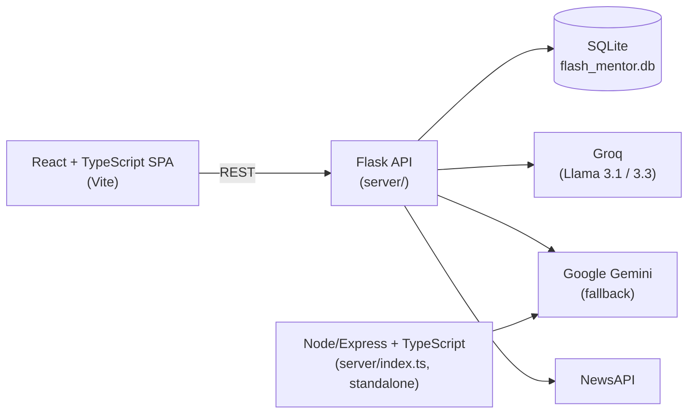
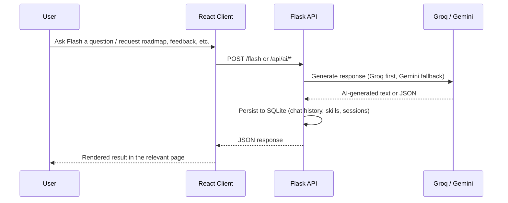

# Flash Mentor: AI-Powered Learning Assistant

A personalized learning platform that combines roadmap tracking, AI-generated mentorship, and productivity tools into a single dashboard.


## Table of Contents

- [Overview](#overview)
- [Problem Statement](#problem-statement)
- [Solution](#solution)
- [Features](#features)
- [Architecture](#architecture)
- [Tech Stack](#tech-stack)
- [Project Structure](#project-structure)
- [System Workflow](#system-workflow)
- [Installation](#installation)
- [Configuration](#configuration)
- [Running Locally](#running-locally)
- [API Documentation](#api-documentation)
- [AI Integration](#ai-integration)
- [Author](#author)

## Overview

Flash Mentor is a full-stack learning assistant for students and professionals preparing for technical roles. It tracks structured learning roadmaps, runs mock interviews, reviews code and resumes, and surfaces tech news, all backed by an AI companion ("Flash") accessible from anywhere in the app via a floating chat widget.

## Problem Statement

Learners preparing for technical careers juggle multiple disconnected tools: roadmap trackers, interview prep sites, resume checkers, code review, and news aggregators. Switching between them breaks focus and makes it hard to track overall progress in one place.

## Solution

Flash Mentor unifies these into one React dashboard backed by a Flask API. Learning progress (skills, learning steps, notes, weekly tasks) is persisted in SQLite, while an AI layer (Groq's Llama models, with Gemini as a fallback) powers roadmap generation, mock interviews, code review, and resume analysis on demand.

## Features

| Feature | Description |
|---|---|
| Flash AI companion | Floating chat widget available on every page, backed by Groq (primary) with Gemini fallback, with chat history persisted per session |
| Roadmap Mentor | AI-generates a set of relevant skills and a step-by-step learning path for a chosen skill and level |
| Skill Center | Tracks skill progress and learning step completion, automatically recalculating progress as steps are completed |
| Communication Coach | AI-generates mock technical or HR interview questions, scores submitted answers, and stores session history |
| Tech Radar | Aggregates live technology news via NewsAPI, with an AI-generated news feed (Gemini) as an alternative source |
| Code Optimizer | Analyzes a pasted code snippet for time/space complexity, gives a critique, and returns an optimized rewrite |
| Resume Analyzer | Scores resume text for ATS compatibility against a target role, listing strengths, weaknesses, and missing keywords |
| Productivity tools | Quick capture notes and a weekly task planner |

## Architecture



> The `server/` directory contains two independent backend implementations: the primary Flask API described above, and a standalone Node/Express + TypeScript service (`index.ts`, `routes/flash.ts`) that re-implements just the Flash chat endpoint directly against Gemini. They are not meant to run together, both default to port 5000.

## Tech Stack

| Layer | Technology |
|---|---|
| Frontend | React 19, TypeScript, Vite, React Router |
| Primary backend | Flask, Flask-SQLAlchemy, Flask-Migrate (Alembic) |
| Alternate backend | Express, TypeScript (Node), standalone chat-only service |
| Database | SQLite |
| AI providers | Groq (Llama 3.1 / 3.3), Google Gemini (`google-generativeai`) |
| External data | NewsAPI |

## Project Structure

```
flash-mentor/
├── client/flash-client/         # React + TypeScript frontend (Vite)
│   └── src/
│       ├── pages/               # RoadmapMentor, SkillCenter, CommunicationCoach,
│       │                        # TechRadar, CodeOptimizer, ResumeAnalyzer, Home
│       ├── components/          # Navbar, FlashAssistantButton/Box
│       ├── contexts/            # FlashContext (chat widget state)
│       └── lib/api.ts           # Backend API client
├── server/                      # Primary Flask backend
│   ├── __init__.py              # App factory, models, all AI + data routes
│   ├── run.py                   # Entry point
│   ├── routes/news.py           # NewsAPI blueprint
│   ├── index.ts                 # Alternate Node/Express backend (standalone)
│   ├── routes/flash.ts          # Alternate backend's Gemini-only chat route
│   └── migrations/              # Flask-Migrate/Alembic migrations
├── migrations/                  # Root-level Alembic migrations
└── requirements.txt
```

## System Workflow



## Installation

**Prerequisites:** Python 3.10+, Node.js 18+, npm

```bash
git clone https://github.com/KAVYAJOSHI1/flash-mentor.git
cd flash-mentor

# Backend
cd server
python -m venv venv
source venv/bin/activate  # On Windows: venv\Scripts\activate
pip install -r ../requirements.txt

# Frontend
cd ../client/flash-client
npm install
```

## Configuration

Create a `.env` file inside `server/` with:

```env
GROQ_API_KEY=your_groq_api_key
GEMINI_API_KEY=your_google_gemini_api_key
NEWS_API_KEY=your_newsapi_key
SECRET_KEY=your_flask_secret_key
```

Create a `.env` file inside `client/flash-client/` with:

```env
VITE_API_BASE_URL=http://localhost:5000
```

`.env` files are gitignored and are not committed to the repository.

## Running Locally

**Backend (Flask, primary):**
```bash
cd server
python run.py
```
Runs at `http://localhost:5000`.

**Frontend:**
```bash
cd client/flash-client
npm run dev
```
Runs at `http://localhost:5173` (or the port shown in your terminal).

**Alternate backend (Node/Express, standalone):** only run this instead of the Flask backend, not alongside it, since both default to port 5000.
```bash
cd server
npm install
npm run dev
```

## API Documentation

All routes below are served by the primary Flask backend (`server/__init__.py`).

| Endpoint | Method | Description |
|---|---|---|
| `/flash` | POST | Chat with the Flash AI companion; persists history per session |
| `/api/chat/<session_id>` | GET | Retrieve chat history for a session |
| `/api/skills` | GET | List all tracked skills |
| `/api/skills/batch` | POST | Add multiple skills at once |
| `/api/skills/<id>/learning_steps` | GET | Get learning steps for a skill |
| `/api/learning_steps/batch` | POST | Add multiple learning steps |
| `/api/learning_steps/<id>/complete` | POST | Mark a learning step complete and recalculate skill progress |
| `/api/ai/generate_skills` | POST | AI-generate a set of relevant skills for a category |
| `/api/ai/generate_learning_path` | POST | AI-generate a step-by-step learning path for a skill |
| `/api/ai/generate_interview_questions` | POST | AI-generate mock interview questions (technical or HR) |
| `/api/ai/generate_interview_feedback` | POST | AI-score interview answers and return feedback |
| `/api/ai/generate_tech_news` | POST | AI-generate tech news articles (Gemini) |
| `/api/ai/optimize_code` | POST | Analyze code complexity and return an optimized version |
| `/api/ai/analyze_resume` | POST | Score resume text for ATS compatibility |
| `/api/news` | GET | Fetch live tech news via NewsAPI |
| `/api/notes` | GET / POST | Read or create quick capture notes |
| `/api/weekly_tasks` | GET / POST / PUT / DELETE | Manage the weekly task planner |
| `/api/learning_sessions` | GET / POST | Track interview/practice session history |

## AI Integration

1. **Provider fallback:** a shared `generate_ai_content()` helper tries Groq first (`llama-3.1-8b-instant` for quick responses, `llama-3.3-70b-versatile` for complex generation), then falls back to Gemini (`gemini-flash-latest`) if Groq fails or isn't configured.
2. **Structured generation:** most AI routes (skills, learning paths, interview questions, resume analysis) prompt the model to return strict JSON, then parse and validate it before returning it to the client.
3. **Graceful degradation:** if both providers fail, several routes (interview questions, interview feedback, code optimization) fall back to hardcoded mock responses rather than failing the request outright.
4. **Conversational chat:** the `/flash` endpoint maintains per-session chat history in SQLite and includes it as context on each call to keep the conversation coherent.

## Author

**Kavya Joshi**
[Portfolio](https://kavyajoshi1.github.io/) · [LinkedIn](https://linkedin.com/in/kavya-joshi-3765742b0) · [GitHub](https://github.com/KAVYAJOSHI1)
